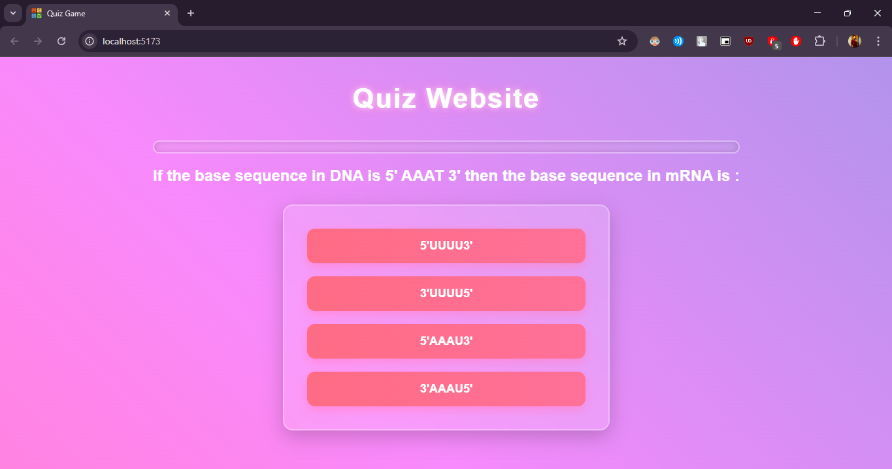
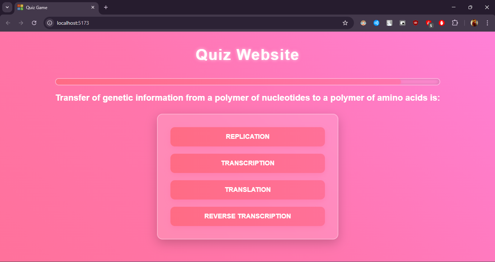
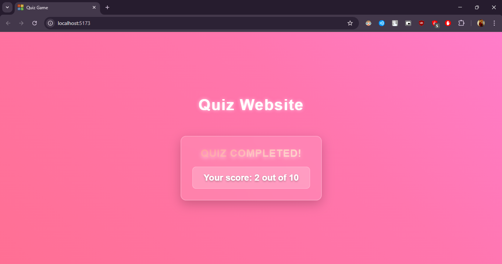

# GitHub Assignment Submission

## Project Setup

Follow the steps below to set up and run the project locally:

1. **Clone the repository:**
   ```sh
   git clone https://github.com/itzgauravgoswami/Testline-Assignment-Submission
   ```

2. **Install dependencies:**
   ```sh
   npm install
   ```

3. **Start the development server:**
   ```sh
   npm run dev
   ```

## Demo Video
**Link for the Video**

**https://youtu.be/RlmDS5JtVvk**

## Screenshots

### First Question Page


### Last Question Page


### Result Page


---

